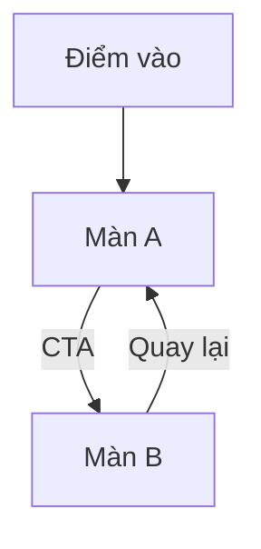

# Flow file format

Use Mermaid `flowchart TD` for navigation and user journeys. Node IDs are stable `UPPER_SNAKE_CASE`; visible labels are short and Vietnamese or product copy.

Represent decisions as `{Condition?}` and failure paths explicitly. Annotate a transition only when it passes data: `-->|bpm: Int| ADD_RECORD`.

For each changed node, create a matching screen spec and include its `Screen` enum mapping. If a step is not yet implemented, label it `Planned` in the screen spec; do not add it to `App.kt` merely to make the diagram complete.
